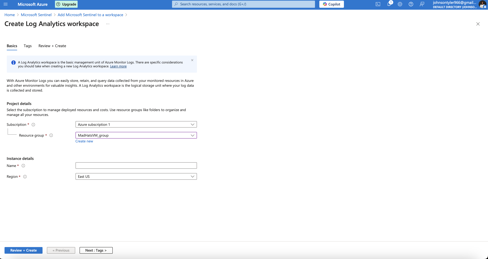
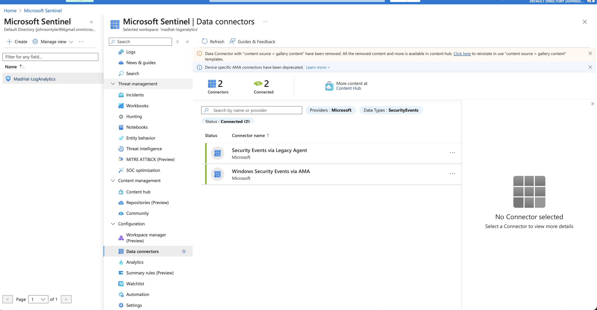
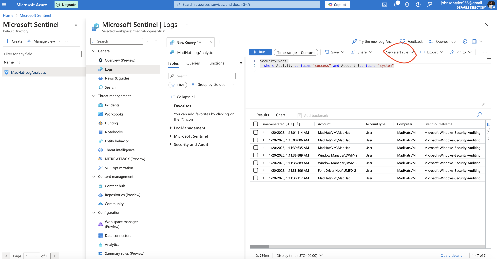
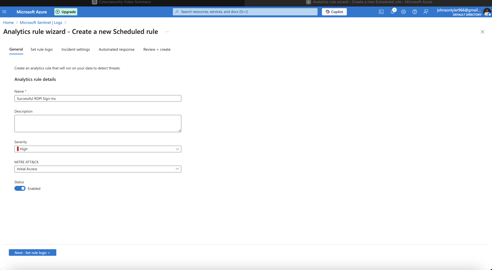
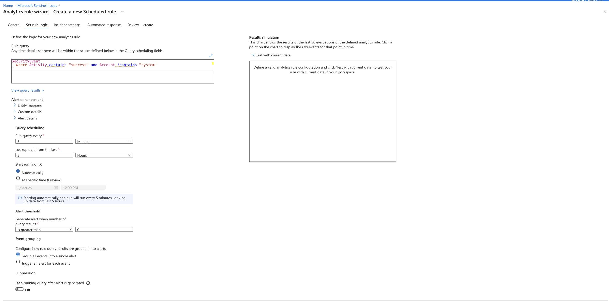
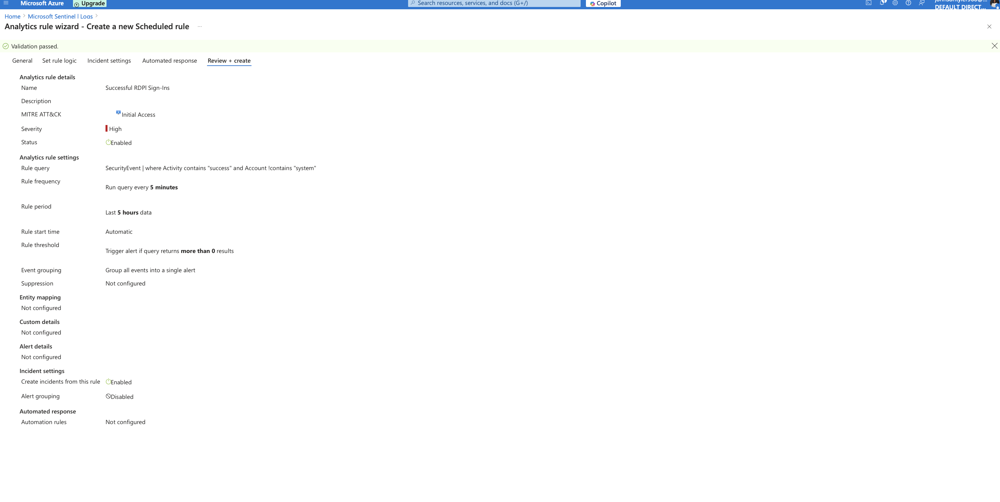
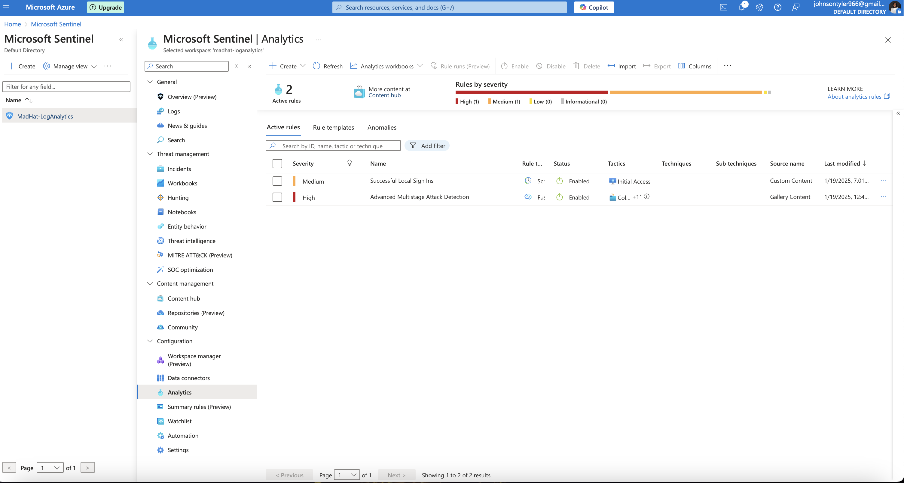

<h1>SIEM/SOC Honeypot Lab Setup</h1>

 

<h2>Description</h2>
In this hands-on project, I built and deployed a personal Security Operations Center (SOC) by setting up a SIEM system using Microsoft Sentinel. The system is designed to monitor security events from a Windows Virtual Machine on Azure, with a focus on detecting unauthorized access attempts through RDP.
<br />


<h2>Utilities Used</h2>

- <b>Microsoft Azure</b> 
- <b>Microsoft Sentinel</b>
- <b>RDP</b>
- <b>Windows VM</b>

<h2>Environments Used </h2>

- <b>Windows 11</b> (21H2)

<h2> Key Skills & Technologies</h2>

- <b>Azure: Utilized Azure Free Tier to create and manage a Windows Virtual Machine (VM) and configure cloud-based security operations.</b>
- <b>Threat Monitoring: Configured alerts and monitoring for RDP (Remote Desktop Protocol) activity to detect unauthorized access attempts.</b>
- <b>Incident Response: Set up custom security alerts to automatically notify upon successful unauthorized login attempts, helping to simulate real-world cyberattack scenarios.</b>
- <b>Windows Security: Gained experience with event log collection, analysis, and management from a Windows VM using Azure Monitor Agent.</b>
- <b>Automation: Automated incident creation and alerting based on event detection, optimizing security monitoring workflows.</b>
- <b>Threat Intelligence: Integrated threat intelligence feeds to simulate and monitor indicators of compromise (IOCs) in a controlled environment.</b>


<h2>Lab walk-through:</h2>

<p align="center">
 Create an Azure Virtual Machine: (VM): <br/>
<ul>
  <li>Go to <strong>Azure Portal</strong> and search for <strong>Virtual Machines</strong></li>
  <li>Click <strong>Create > Virtual Machine</strong></li>
  <li>Select <strong>Windows Pro</strong> as the OS</li>
  <li>Configure the following:
    <ul>
      <li><strong>Resource Group:</strong> Create a new one (e.g., <em>Mad Hat Group</em>)</li>
      <li><strong>Virtual Machine Name:</strong> (e.g., <em>MadHat-VM</em>)</li>
      <li><strong>Region:</strong> Select the preferred Azure region</li>
      <li><strong>Administrator Username:</strong> e.g., <em>madhathimself</em></li>
      <li><strong>Password:</strong> Secure password of your choice</li>
    </ul>
  </li>
  <li><strong>Allow RDP (Port 3389) Access</strong></li>
  <li>Click <strong>Review and Create</strong></li>
  <li>Wait for the VM to be deployed</li>
</ul>


<br />
<br />
 Deploy Microsoft Sentinel:  <br/>

<ul>
  <li><strong>Create a Log Analytics Workspace</strong>
    <ul>
      <li>Search for <strong>Log Analytics Workspaces</strong> in the Azure portal</li>
      <li>Click <strong>Create</strong></li>
      <li>Set the following configurations:
        <ul>
          <li><strong>Resource Group:</strong> Select previously created group</li>
          <li><strong>Region:</strong> Same as VM region</li>
          <li><strong>Workspace Name:</strong> e.g., <em>MadHatWorkspace</em></li>
        </ul>
      </li>
      <li>Click <strong>Review + Create</strong> and wait for deployment</li>
    </ul>
  </li>
  <li><strong>Set Up Microsoft Sentinel</strong>
    <ul>
      <li>Search for <strong>Microsoft Sentinel</strong> in the Azure portal</li>
      <li>Click <strong>Create</strong></li>
      <li>Select the <strong>Log Analytics Workspace</strong> created earlier</li>
      <li>Click <strong>Add Microsoft Sentinel</strong></li>
    </ul>
  </li>
</ul>


 
<br />
<br />
Connect the VM to Sentinel: <br/>

<ul>
  <li><strong>Install the Azure Monitor Agent (AMA)</strong>
    <ul>
      <li>Go to <strong>Sentinel > Content Hub</strong></li>
      <li>Search for <strong>Azure Monitor Agent</strong></li>
      <li>Click <strong>Install</strong></li>
    </ul>
  </li>
  <li><strong>Set Up Data Connectors</strong>
    <ul>
      <li>Go to <strong>Sentinel > Data Connectors</strong></li>
      <li>Select <strong>Windows Security Events</strong></li>
      <li>Click <strong>Open Connector Page</strong></li>
      <li>Click <strong>Create Data Collection Rule</strong></li>
      <li>Configure:
        <ul>
          <li><strong>Rule Name:</strong> e.g., <em>Windows Events to Sentinel</em></li>
          <li><strong>Resources:</strong> Select <em>MadHat-VM</em></li>
          <li><strong>Events to Collect:</strong> Select <strong>All Security Events</strong></li>
        </ul>
      </li>
      <li>Click <strong>Create</strong></li>
    </ul>
  </li>
</ul>


<br />
<br />
Create an Alert Rule in Sentinel:  <br/>
<ul>
  <li>Go to <strong>Sentinel > Logs</strong></li>
  <li>Click <strong>Create > New Rule</strong></li>
  <li>Configure:
    <ul>
      <li><strong>Rule Name:</strong> e.g., <em>Successful RDP Login</em></li>
      <li><strong>Severity:</strong> Set to <em>High</em></li>
      <li><strong>Rule Frequency:</strong> Every 5 minutes</li>
      <li><strong>Query:</strong> (Detects successful RDP logins)</li>
      <li><strong>Enable Incident Creation</strong></li>
    </ul>
  </li>
  <li>Click <strong>Review + Create</strong></li>
</ul>








<br />
<br />
Testing and Monitoring:  <br/>
<ul>
  <li><strong>Simulate an RDP Attack</strong>
    <ul>
      <li>Leave the RDP port (3389) open and wait for brute-force attempts</li>
      <li>View incoming login attempts in <strong>Sentinel > Incidents</strong></li>
    </ul>
  </li>
  <li><strong>Verify Incident Creation</strong>
    <ul>
      <li>Check if <strong>alerts</strong> appear in <strong>Microsoft Sentinel</strong></li>
      <li>Validate that successful logins trigger security incidents</li>
    </ul>
  </li>
</ul>


<br />
<br />
Sanitization complete:  <br/>

<br />
<br />
Observe the wiped disk:  <br/>

</p>

<!--
 ```diff
- text in red
+ text in green
! text in orange
# text in gray
@@ text in purple (and bold)@@
```
--!>
  
